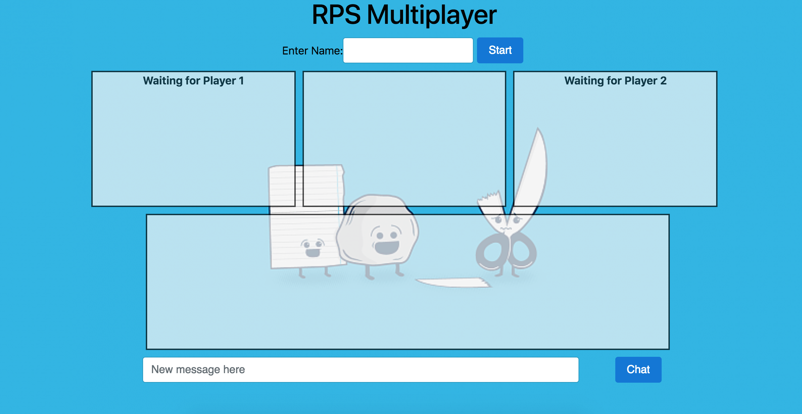
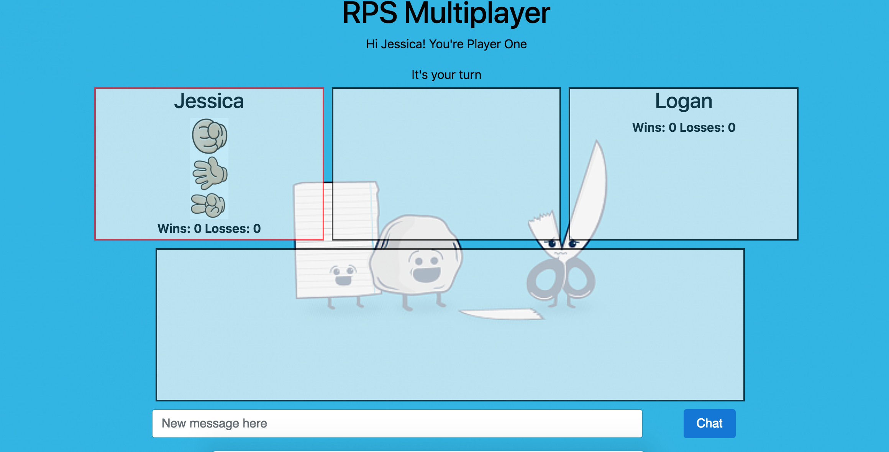
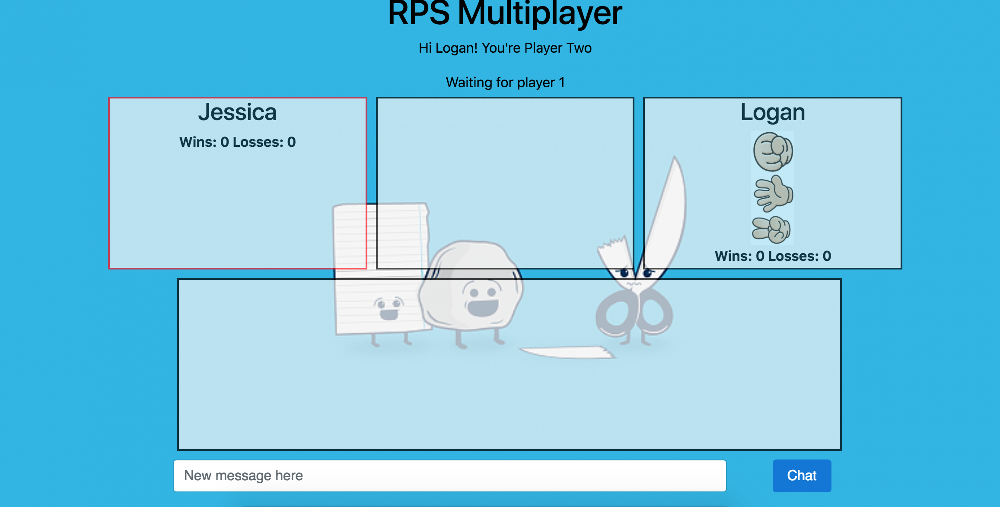
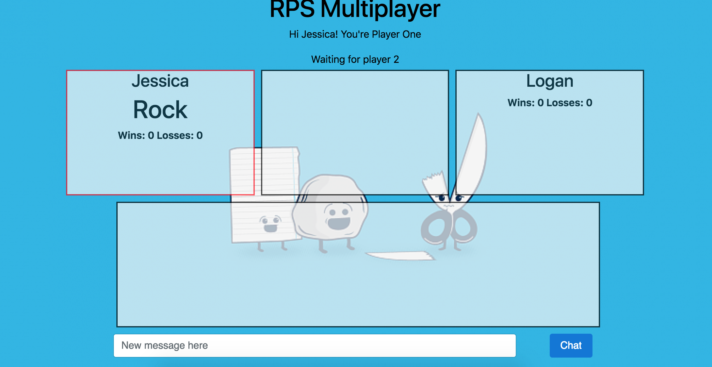
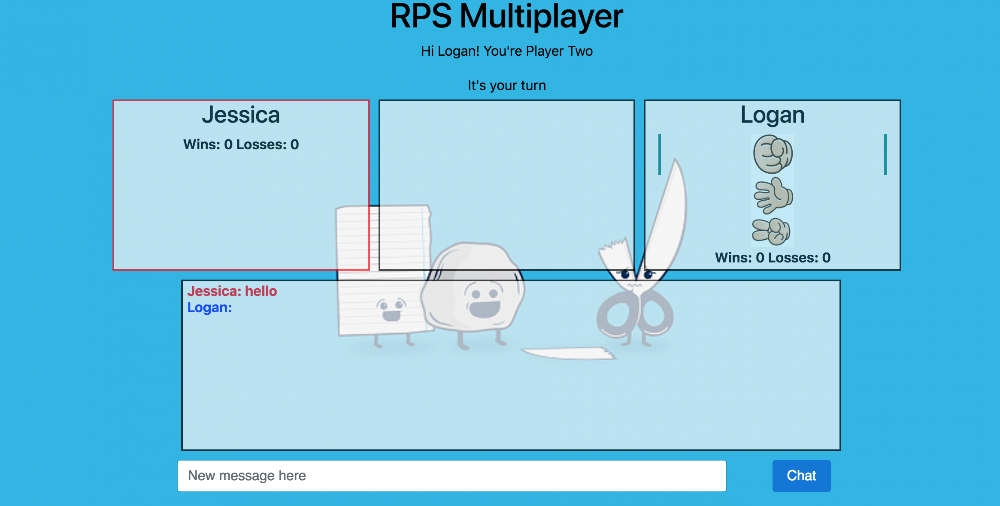
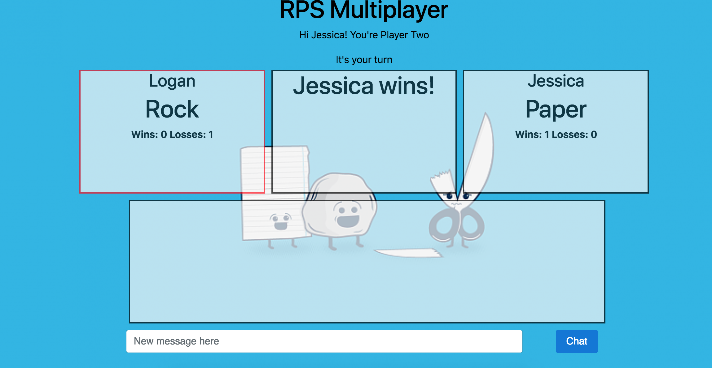
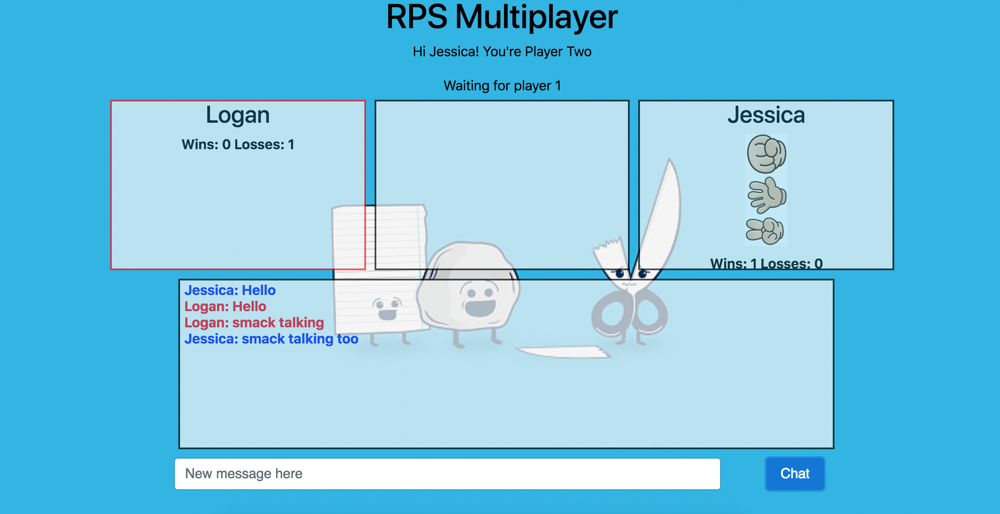

# RPS - Multiplayer

## Purpose 
 
The sole purpose of this project is to create a multi-player game using Google Firebase.

## Technologies Used

* Html
* CSS
* Bootstrap CSS
* Javascript
* Jquery
* Google Firebase

## Future Features

1. Computer AI
2. More than one game room
3. User login feature

## Bugs That Need Work

1. The chat room loading name when player enters.
2. Not allowing more players to chat while waiting for game

## Game Play

Enter your name to be assigned if your player 1 or player 2. In order to play with two players you need to open up two different home screen pages. Or be on different devices.

Once you have entered your name and no one else is playing your assigned player one.

Player two enters their name in a seperate window and enters into the game play.

The game play begins once two players are playing. Player one will select a weapon from the images. The choices are rock, paper, and scissors. It will then store that weapon and switch to player two to select their weapon.

Player two will select their weapon from the image choices. Which are rock, paper, and scissors. It will store that selection and send results from both players.

The results will be displayed with what weapon both players picked and what player won the game. The players records will be updated with wins and losses. After a few seconds the game will automatically reset for both players to play again.

During the game play the players can chat with each other while playing the game. Each player is displayed in different color text.

## Demo

[RPS Demo Link](https://jterry149.github.io/RPS-Multiplayer/)